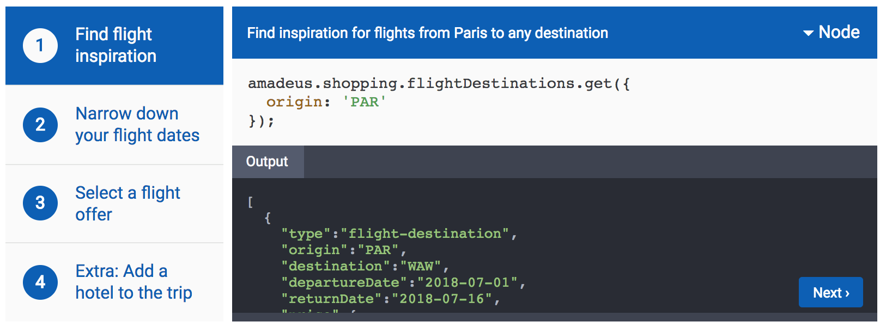

# Amadeus Exploration Docs

This project contains the code for the Amadeus Exploration Demo in a package of
less than 50kb.



## Usage

To use the library apply the following 3 steps to your HTML.

```html
<!-- 1. Load the latest build into the HEAD of your HTML -->
<head>
  <script src="exploration-demo.js"></script>
</head>

<!-- 2. Create an HTML element with a class name or ID  -->
<div id='target' />

<!-- 3. At the bottom of your HTML initialize the demo -->
<script type="text/javascript">
  exploration.setup({
    // This element name is used in a JS querySelector
    element: '#target',
    // This URL should contain your config.json and sample code
    url: 'http://exmaple.com/path/to/config'
  });
</script>
```

This will initialize the demo and bind it to the selected element.

## Configuration

For configuration, the widget expects the following files to exist at the
specified URL.

```
- config.json
- code/
  - [step_name].[language_name]
  - [step_name].out.json
```

### `config.json`

The config file contains the set of steps, their IDs, paths, and where to link to next.
It also contains a list of languages and the default language.

```json
{
  "steps" : {
    "find": {
      "title" : "Find flight inspiration",
      "path" : "/",
      "description" : {
        "text" : "Find inspiration for flights from Paris to any destination"
      },
      "next": {
        "text": "Next",
        "path": "/narrow"
      }
    },
    ...
  },
  "languages" : {
    "js" : "Node",
    "rb" : "Ruby",
    "py" : "Python",
    "java" : "Java"
  },
  "defaultLanguage": "js"
}
```

This file is loaded first and then the code is loaded for each step.

### `code/*`

In the code folder we expect a set of files containing the content for each
step code sample, as well as the JSON output example.

For the code samples, we expect a format of `[step_name].[language_name]`. For
the above config we'd expect the following:

```
- code/find.rb
- code/find.py
- code/find.java
- code/find.js
- code/find.out.json
```

## Styling

The default style for the widget is built-in. To add custom styles, the CSS can
be customised with an additional CSS file. The following basic structure exists
in the HTML and CSS classes.

```
div.exploration-demo
  nav.exploration-demo-steps
    a
  section.exploration-demo-blocks
    section.exploration-demo-block
      header
        .description
        .languages
          .selected
          .content
      section.code
      section.bar
      a.nextButton
      section.output
```

## Development

To start the dev server run the `yarn start` command.

This will open a new browser and run linting, and compile the widget ready
for the browser.

## Distribution

Currently distribution has not been set up yet. To make a build,
run the `yarn build` command.
